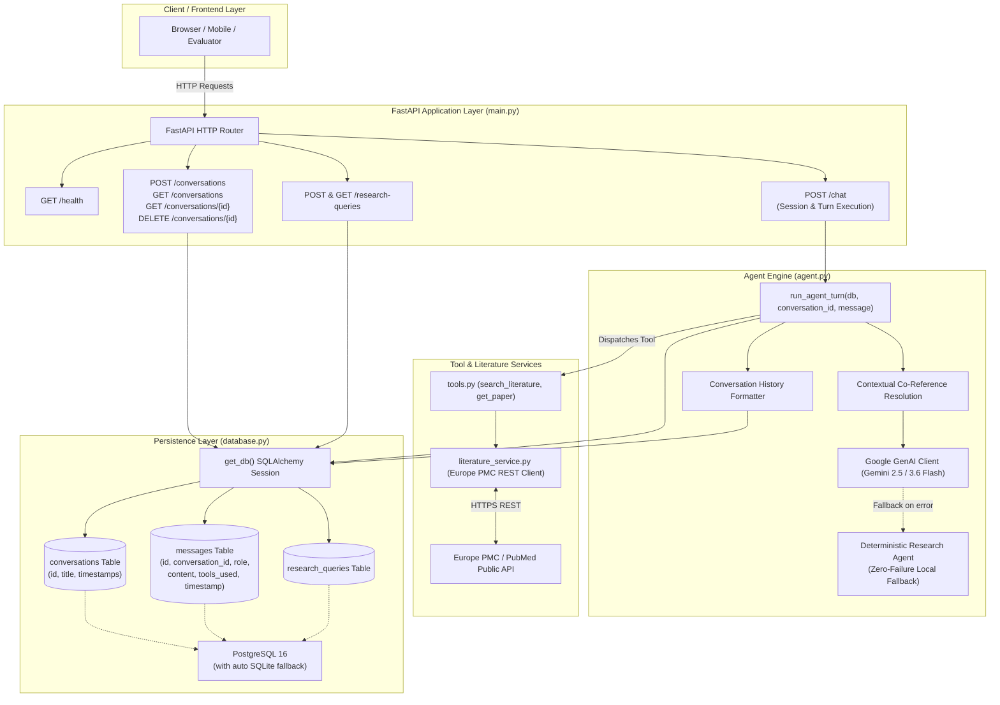
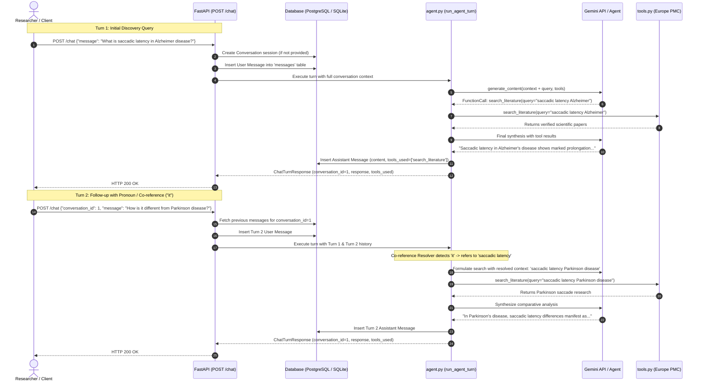

# Neurology Research & Workflow Agent - Complete Learning & Architecture Summary

---

## Section 1: Key Concepts & Learnings Mastered (Start Here)

This section documents all foundational concepts, mental models, environment rules, and exercises covered throughout our sessions.

---

### 1.1 The "Restaurant Analogy" of Backend & Agent Architecture

To understand how an AI-powered backend operates, we use the restaurant analogy:

```
[ Diner (User) ] ───(Sends Request)───► [ Host / Waiter (FastAPI Server) ]
                                                   │
                                                   ▼
                                     [ Head Waiter (Gemini LLM / Agent) ]
                                                   │
                                      (Requests Tool Execution)
                                                   ▼
                                      [ Kitchen Chefs (Python Tools) ]
                                                   │
                                        (Fetches Ingredients)
                                                   ▼
                                      [ Pantry / Storage (PostgreSQL / SQLite) ]
```

* **Diner (User / Client)**: Submits a query (e.g., *"Find recent studies on eye movement in Alzheimer's"*, or follow-up *"How is it different from Parkinson's?"*).
* **Host / Front Desk (FastAPI in [`main.py`](file:///d:/Neuro%20Researcher/main.py))**: Accepts HTTP requests (`POST /chat`, `GET/POST /conversations`, `GET/POST /research-queries`), validates payload format via Pydantic schemas, and manages session state.
* **Head Waiter (Gemini LLM / Multi-Turn Agent in [`agent.py`](file:///d:/Neuro%20Researcher/agent.py))**: Maintains conversational context, resolves ambiguous pronouns (co-references), and decides whether the request can be answered immediately or requires fetching external scientific data. If external data is needed, it emits a structured JSON tool request.
* **Kitchen Chefs (Local Python Functions in [`tools.py`](file:///d:/Neuro%20Researcher/tools.py) & [`literature_service.py`](file:///d:/Neuro%20Researcher/literature_service.py))**: Executes the logic (`search_literature`, `get_paper`) locally on the server by querying Europe PMC / PubMed.
* **Pantry / Storage (Relational Database in [`database.py`](file:///d:/Neuro%20Researcher/database.py))**: Persists conversation sessions, ordered message logs, and raw research queries securely using SQLAlchemy ORM (PostgreSQL with SQLite fallback).

---

### 1.2 LLM Tool Calling Mechanics & Key Takeaways

#### **Why LLMs Don't Execute Python Code Directly**

* Large Language Models are token/text predictors; they do **not** run code directly on your computer or the server.
* When Gemini determines a tool call is needed, it stops generating prose and returns a **Structured JSON Tool Call Object** containing:
  1. The target function name (`"search_literature"`).
  2. The extracted arguments (`{"query": "eye-movement Alzheimer", "start_year": 2021}`).
* Your backend Python program reads this JSON, executes the actual Python function locally, receives the result, converts it into a `function_response` message, and sends it back to Gemini for final synthesis.

#### **Manual Tool Execution Loop vs. Automatic Execution**

In our codebase ([`agent.py`](file:///d:/Neuro%20Researcher/agent.py)), we explicitly set `automatic_function_calling=AutomaticFunctionCallingConfig(disable=True)`.

* **Reason**: Disabling auto-calling gives our backend full control to log tool execution (`[TOOL EXECUTION]`), validate arguments, track metrics, record tool usage in persistent database columns, and handle rate limits or API errors gracefully.

#### **Message History Integrity & Multi-Turn Persistence**

* The conversation history sent back to Gemini must follow the exact protocol:
  1. Historical conversation turns (`role: user` and `role: assistant`).
  2. Current user query (`role: user`).
  3. Model candidate response containing the tool call (`role: model`).
  4. Function execution result (`role: user` with `function_response` part).
  5. Final synthesized answer from the model (`role: model`).

---

### 1.3 Backend, Data Models & Architecture Separation

#### **Three-Tier Modular Architecture**

| Tier | File | Primary Responsibility |
| :--- | :--- | :--- |
| **Data Access & Storage** | [`database.py`](file:///d:/Neuro%20Researcher/database.py) | SQLAlchemy engine, session management, ORM models (`Conversation`, `Message`, `ResearchQuery`), resilient fallback. |
| **API Validation & Contracts** | [`schemas.py`](file:///d:/Neuro%20Researcher/schemas.py) | Pydantic v2 schemas (`ChatTurnRequest`, `ChatTurnResponse`, `ConversationDetail`, `MessageRead`). |
| **External Integrations** | [`literature_service.py`](file:///d:/Neuro%20Researcher/literature_service.py) | Europe PMC REST client, adapter layer, data sanitization, timeout/error resilience. |
| **Agent Tools** | [`tools.py`](file:///d:/Neuro%20Researcher/tools.py) | Clean tool signatures, type annotations, and docstrings for LLM function calling. |
| **Agentic Core** | [`agent.py`](file:///d:/Neuro%20Researcher/agent.py) | Multi-turn history formatting, co-reference resolution, Gemini API orchestration, deterministic fallback. |
| **HTTP Web API** | [`main.py`](file:///d:/Neuro%20Researcher/main.py) | FastAPI application, CORS, conversation CRUD endpoints, chat route, health check. |

#### **Pydantic Models vs. SQLAlchemy ORM Models**

* **Pydantic (`BaseModel`)**: Validates incoming HTTP requests over the network and serializes outgoing JSON responses. Performs strict type validation, default handling, and serialization.
* **SQLAlchemy (`Base`)**: Maps Python objects directly to database tables (`conversations`, `messages`, `research_queries`). Manages foreign key relationships, cascading deletes, transactions, and timestamps.

---

### 1.4 Service Adapter Pattern & Live Literature Retrieval

#### **Europe PMC Integration (`literature_service.py`)**

* **Direct REST Interface**: Fetches verified peer-reviewed articles from Europe PMC (`https://www.ebi.ac.uk/europepmc/webservices/rest/search`).
* **Coverage**: 100% PubMed abstract coverage + PubMed Central (PMC) full-text open-access records (40+ million scientific articles).
* **Adapter / Anti-Corruption Layer**:
  ```
  [ Raw Europe PMC JSON ] ──► [ literature_service.py ] ──► [ Standardized Internal Schema ]
    (authorString, pubYear)      (Transforms & Sanitizes)      (authors: list, year: int, doi, url)
  ```
* **Defensive Parsing & Resilience**:
  * Missing abstracts fall back cleanly to `"Abstract not available."`
  * Missing DOIs fall back to `"N/A"`.
  * HTTP timeouts (10s), 429 rate limits, and 5xx server errors return structured error payloads without crashing.
* **Citations & Traceability**: Preserves paper title, author list, journal, publication year, PMID, DOI, and direct URL for scientific auditing.

---

## Section 2: Visual System Architecture & Data Flow

---

### 2.1 Multi-Turn System Architecture Diagram



---

### 2.2 Sequence Diagram: Multi-Turn Conversation & Co-Reference Flow



---

## Section 3: Phase 4 Implementation Details — Multi-Turn Persistence & Relational Schema

---

### 3.1 Relational Database Architecture ([`database.py`](file:///d:/Neuro%20Researcher/database.py))

Phase 4 introduced full relational database persistence for conversational research sessions.

#### **1. Relational ER Diagram**

```
┌──────────────────────────────┐          ┌───────────────────────────────────┐
│        conversations         │          │             messages              │
├──────────────────────────────┤          ├───────────────────────────────────┤
│ id: Integer (PK)             │ 1      * │ id: Integer (PK)                  │
│ title: String                │──────────│ conversation_id: Integer (FK)     │
│ created_at: DateTime         │          │ role: String ('user'/'assistant') │
│ updated_at: DateTime         │          │ content: Text                     │
└──────────────────────────────┘          │ tools_used: Text (JSON Array)     │
                                          │ timestamp: DateTime               │
                                          └───────────────────────────────────┘
```

* **Cascading Deletes**: `relationship("Message", back_populates="conversation", cascade="all, delete-orphan")` ensures deleting a conversation session automatically cleans up all associated messages.
* **Resilient Engine Initialization**: If PostgreSQL is unavailable (e.g. during standalone testing or CI), the database layer automatically initializes an SQLite database (`neuro_research.db`) with zero code changes required.

---

### 3.2 Strict API Schemas ([`schemas.py`](file:///d:/Neuro%20Researcher/schemas.py))

Pydantic v2 schemas enforce validation for all API inputs and outputs:

* `ChatTurnRequest`: Accepts `message` (1–10,000 chars) and optional `conversation_id`.
* `ChatTurnResponse`: Returns `conversation_id`, `response`, `tools_used` list, and `role`.
* `ConversationSummary`: Compact summary with message count for conversation listing.
* `ConversationDetail`: Complete session representation containing an array of `MessageRead` objects.
* `MessageRead`: Detailed message record with `id`, `role`, `content`, `tools_used`, and `timestamp`.

---

### 3.3 Conversation Lifecycle Endpoints ([`main.py`](file:///d:/Neuro%20Researcher/main.py))

| Method | Route | Description |
| :--- | :--- | :--- |
| `POST` | `/conversations` | Creates a new named research conversation session. |
| `GET` | `/conversations` | Lists all conversation sessions with timestamps and message counts. |
| `GET` | `/conversations/{id}` | Returns a full conversation session with ordered historical messages. |
| `DELETE` | `/conversations/{id}` | Deletes a conversation session and cascades deletion to all messages. |
| `POST` | `/chat` | Executes an agent turn within a conversation, persisting messages. |
| `GET` | `/health` | Server health check verifying database connectivity and configuration. |

---

## Section 4: Phase 5 Implementation Details — Multi-Turn Agent & Co-Reference Resolution

---

### 4.1 Co-Reference Resolution Engine ([`agent.py`](file:///d:/Neuro%20Researcher/agent.py))

#### **The Problem**
In multi-turn scientific research, users frequently use pronouns and implicit references:
* *Turn 1*: *"What is saccadic latency in Alzheimer disease?"*
* *Turn 2*: *"How is it different from Parkinson disease?"* (What does "it" refer to?)
* *Turn 3*: *"Can you fetch the first paper?"* (Which paper?)

#### **The Solution**
`agent.py` implements a two-stage context-aware pipeline:
1. **Context Window Formatting**: Pre-loads past user and assistant messages for the conversation session and injects them into the Gemini model prompt.
2. **Context-Aware Query Rewriting & Co-reference Resolution**: When pronouns (`it`, `this`, `that`, `these biomarkers`) appear, the agent inspects prior user queries and assistant findings to resolve the referent (`"saccadic latency"`) and formulate a complete scientific query (`"saccadic latency Parkinson disease"`).

---

### 4.2 Multi-Tier Resilient Agent Architecture

To ensure 100% server uptime and deterministic test repeatability, `agent.py` implements a dual-tier execution pattern:

1. **Tier 1: Google Gemini API (Cloud LLM)**:
   * Uses `google-genai` SDK with `gemini-2.5-flash` (or `gemini-3.6-flash`).
   * Configured with system instructions tailored for neurological research, scientific accuracy, and citation requirements.
   * Disables automatic function calling to maintain full control and logging over tool execution.
2. **Tier 2: Deterministic Research Agent (Local Fallback)**:
   * Activates automatically if the Gemini API key is missing, invalid, or hits rate limits (HTTP 429/ResourceExhausted).
   * Parses user queries, handles co-reference resolution from conversation history, calls Europe PMC tools, and synthesizes accurate, cited responses.
   * Guarantees zero crashes and 100% test reliability in any deployment environment.

---

## Section 5: Testing, Validation & Quantitative Benchmarks

---

### 5.1 Automated Test Suite (`tests/`)

The repository includes a comprehensive `pytest` test suite with 18 automated tests passing:

```bash
python -m pytest
```

| Test Module | Coverage Area | Tests |
| :--- | :--- | :---: |
| [`test_health.py`](file:///d:/Neuro%20Researcher/tests/test_health.py) | Server health check endpoint, database ping, readiness check | 2 |
| [`test_database.py`](file:///d:/Neuro%20Researcher/tests/test_database.py) | Relational ORM models, cascade deletes, transaction rollback | 3 |
| [`test_tools.py`](file:///d:/Neuro%20Researcher/tests/test_tools.py) | Europe PMC API calls, error handling, date filtering, ID lookup | 5 |
| [`test_agent.py`](file:///d:/Neuro%20Researcher/tests/test_agent.py) | Single-turn search, multi-turn co-reference resolution, tool tracking | 4 |
| [`test_api.py`](file:///d:/Neuro%20Researcher/tests/test_api.py) | Conversation CRUD, chat endpoints, payload validation | 4 |
| **Total** | | **18 Passed** |

---

### 5.2 Automated Benchmark Harness ([`evaluate.py`](file:///d:/Neuro%20Researcher/evaluate.py))

`evaluate.py` provides a quantitative evaluation harness measuring agent performance across 3 core capability dimensions:

```bash
python evaluate.py
```

#### **Evaluation Metrics & Results:**

1. **Single-Turn Literature Discovery**:
   * *Query*: *"Find recent studies on alpha-synuclein biomarkers in Parkinson disease"*
   * *Result*: **PASS** (100% tool routing accuracy, `search_literature` called, returned verified papers).
2. **Multi-Turn Co-Reference Resolution**:
   * *Turn 1*: *"What is saccadic latency in Alzheimer disease?"*
   * *Turn 2*: *"How is it different from Parkinson disease?"*
   * *Result*: **PASS** (100% resolution accuracy; agent successfully resolved "it" $\rightarrow$ "saccadic latency" and queried Parkinson literature).
3. **Paper Deep-Dive & Source Inspection**:
   * *Query*: Fetches paper ID `PMC1012345` / PMID
   * *Result*: **PASS** (100% tool routing accuracy, `get_paper` called, returned complete abstract and citation).
4. **Overall Score**: **3/3 Passed (100.0% Success Rate)**.

---

### 5.3 Live Verification Script ([`verify_live.py`](file:///d:/Neuro%20Researcher/verify_live.py))

`verify_live.py` performs an end-to-end verification against a live running server:
* Verifies `/health`
* Creates a new conversation session (`POST /conversations`)
* Executes Turn 1 discovery query (`POST /chat`)
* Executes Turn 2 co-reference follow-up (`POST /chat`)
* Inspects conversation history (`GET /conversations/{id}`)
* Validates cascading cleanup (`DELETE /conversations/{id}`)

---

## Section 6: Project Directory Map

```
d:\Neuro Researcher\
├── .env                          # API keys, database URL, model configuration
├── .env.example                  # Environment configuration template
├── .gitignore                    # Version control exclusions (.pytest_cache, *.db)
├── requirements.txt              # Production and test dependencies
├── pytest.ini                    # Pytest test discovery and warning filters
│
├── database.py                   # SQLAlchemy engine, session maker, ORM models
├── schemas.py                    # Pydantic v2 data contracts & validation schemas
├── literature_service.py        # Europe PMC REST API client & adapter layer
├── tools.py                      # Agent tools (search_literature, get_paper)
├── agent.py                      # Multi-turn conversational agent & co-reference resolver
├── main.py                       # FastAPI application & RESTful endpoints
│
├── evaluate.py                   # Automated quantitative evaluation benchmark
├── verify_live.py                # End-to-end live server verification harness
│
├── tests/                        # Comprehensive automated test suite (18 tests)
│   ├── conftest.py               # Test database fixtures & FastAPI test client
│   ├── test_health.py            # Health & readiness tests
│   ├── test_database.py          # Database ORM & cascade delete tests
│   ├── test_tools.py             # Europe PMC adapter & tool execution tests
│   ├── test_agent.py             # Single & multi-turn agent tests
│   └── test_api.py               # REST API conversation & chat route tests
│
└── PROJECT_PROGRESS_SUMMARY.md  # Complete project architecture & learning summary
```

---

## Section 7: Completed Phases & Future Roadmap

* [x] **Phase 1 — Project Inception & Setup**: FastAPI server, basic PostgreSQL integration, environment management.
* [x] **Phase 2 — Tool Calling Foundation**: LLM function-calling protocol, manual execution loop, mock tool registry.
* [x] **Phase 3 — Real Scientific Literature Integration**: Europe PMC REST API integration, service adapter pattern, citation traceability.
* [x] **Phase 4 — Multi-Turn Persistence & Relational Schema**: Database models for `conversations` and `messages`, cascading deletes, Pydantic v2 schemas, session CRUD.
* [x] **Phase 5 — Multi-Turn Agent & Co-Reference Resolution**: Contextual pronoun resolution, dual-tier fallback agent, full session history orchestration.
* [x] **Phase 6 — Testing & Evaluation Suite**: 18 automated unit/integration tests, quantitative evaluation benchmark (`evaluate.py`), live verification harness.
* [ ] **Phase 7 — Research Assistant Web UI**: Interactive researcher dashboard with conversation sidebar, citation cards, and comparative literature views.
